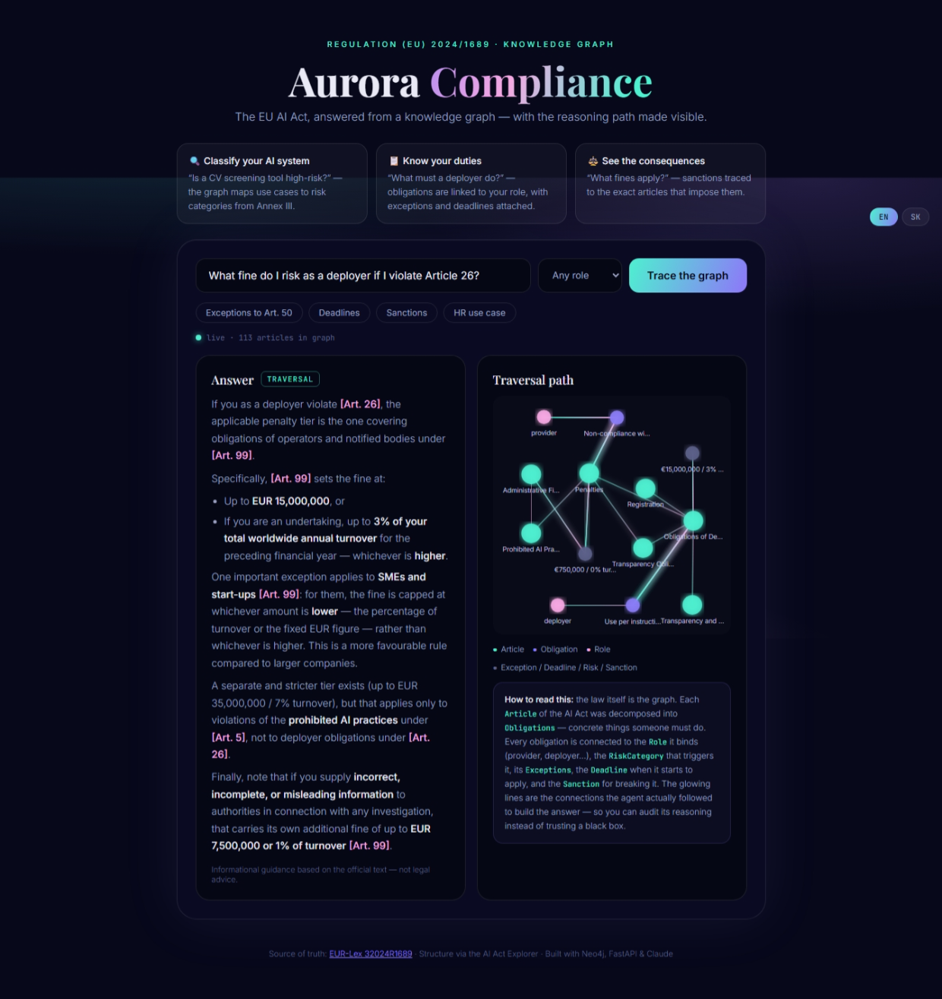

# ✦ Aurora Compliance




**GraphRAG assistant for the EU AI Act** (Regulation (EU) 2024/1689), built on a Neo4j
knowledge graph. Ask compliance questions in natural language — the agent routes between
graph traversal, vector search, or both, answers with article citations, and **visualizes
the exact path it traversed** through the graph.

> The Act becomes fully applicable on **2 August 2026** — this assistant exists for
> exactly that moment.

## Architecture

```
EUR-Lex / AI Act Explorer
        │  (ingest_aiact.py: fetch → LLM extraction → embeddings)
        ▼
   Neo4j KG  ── Articles · Obligations · Roles · RiskCategories
        │       Exceptions · Deadlines · Sanctions · Chunks (vector index)
        ▼
  FastAPI backend ── router agent (Claude Haiku) picks strategy:
        │            TRAVERSAL (multi-hop Cypher) / VECTOR / HYBRID
        │            answer synthesis (Claude Sonnet) with [Art. N] citations
        ▼
  Aurora frontend ── glassmorphism UI, D3 force graph with holographic glow
```

## Quick start

```bash
# 1. Neo4j (Docker)
docker run -d --name aurora-neo4j -p 7474:7474 -p 7687:7687 \
  -e NEO4J_AUTH=neo4j/yourpassword neo4j:5

# 2. Schema + seed data (works immediately, no scraping needed)
cat schema/schema.cypher ingest/seed_sample.cypher | cypher-shell -u neo4j -p yourpassword

# 3. Backend
pip install fastapi uvicorn neo4j anthropic openai httpx beautifulsoup4
export NEO4J_PASSWORD=yourpassword ANTHROPIC_API_KEY=... OPENAI_API_KEY=...
uvicorn backend.main:app --reload

# 4. Frontend — open frontend/index.html (demo mode works standalone;
#    wire fetch('/ask') to the backend for live GraphRAG)

# 5. Full ingest (all 113 articles, ~15 min)
python ingest/ingest_aiact.py --stage all
```

## Data sources

| Source | Use |
|---|---|
| [EUR-Lex 32024R1689](https://eur-lex.europa.eu/eli/reg/2024/1689/oj) | canonical text (also via CELLAR SPARQL/REST) |
| [AI Act Explorer](https://artificialintelligenceact.eu/ai-act-explorer/) | article-by-article structure, recital matrix |

All public — no DLP concerns. 🙂

## Why GraphRAG here beats plain RAG

Compliance questions are **multi-hop by nature**: obligation → role → exception →
deadline → sanction. Vector similarity alone retrieves "similar paragraphs"; the graph
retrieves the *legal structure*. The killer feature: every answer ships with the
traversed subgraph, so the reasoning is auditable — which is the whole game in
regulated domains.

## Roadmap

- [ ] Wire frontend to live `/ask`
- [ ] Recital ↔ article interpretation edges (Kai Zenner matrix)
- [ ] GDS: PageRank on `REFERS_TO` to surface load-bearing articles
- [ ] Compliance checklist generator per role + use case
- [ ] Second regulation (GDPR) → cross-framework queries

---
*Informational guidance, not legal advice. Built with Neo4j · FastAPI · LangGraph-style routing · Claude.*
